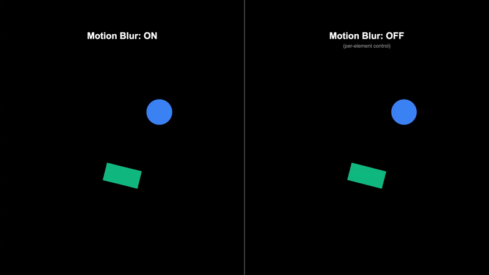

<br/>
<p align="center">
  <a href="https://re.video">
    <picture>
      <source media="(prefers-color-scheme: dark)" srcset="./logo_dark.svg">
      
    </picture>
  </a>
</p>
<p align="center">
  <a href="https://lerna.js.org"></a>
  <a href="https://vitejs.dev"></a>
  <a href="https://www.npmjs.com/package/@revideo/core"></a>
  <a href="https://discord.com/invite/JDjbfp6q2G"></a>
</p>
<br/>

# Revideo Fork: Professional Motion Blur

**This fork adds professional-grade motion blur to Revideo** using temporal sub-frame accumulation - the same technique used in film and professional video production.

<p align="center">
  
</p>

## Motion Blur Features

### Temporal Sub-Frame Accumulation

The implementation renders multiple sub-frames within each output frame's time window and blends them together with configurable weights. This approach:

- Produces physically accurate motion blur matching real camera behavior
- Supports any frame rate and resolution
- Works with all Revideo animations and components

### Quality Presets

| Preset | Samples | Use Case |
|--------|---------|----------|
| `low` | 4 | Fast previews, draft renders |
| `medium` | 8 | Good balance of quality and speed |
| `high` | 16 | High quality production renders |
| `ultra` | 32 | Maximum quality |

### Shutter Angle

Controls exposure time as a fraction of frame duration, simulating a rotary disc shutter:

| Angle | Exposure | Effect |
|-------|----------|--------|
| 90 degrees | 25% | Minimal blur, staccato motion |
| 180 degrees | 50% | Film standard, natural motion |
| 270 degrees | 75% | Pronounced blur |
| 360 degrees | 100% | Maximum blur, dreamy effect |

### Shutter Curves

Sample weighting distribution for different blur characteristics:

- **Box**: Equal weight for all samples (sharp, defined edges)
- **Triangle**: Linear falloff from center (softer blur)
- **Gaussian**: Bell curve distribution (most natural, mimics real cameras)

### Shutter Position

Controls when the blur occurs relative to the frame:

- **Center**: Blur straddles the frame (recommended)
- **Start**: Blur trails behind (forward/leading motion)
- **End**: Blur leads ahead (backward/trailing motion)

### Per-Element Motion Blur Control

Individual elements can override the global motion blur setting. This is essential for:

- Keeping text and UI elements sharp
- Creating visual contrast between static and moving elements
- Performance optimization

```tsx
// This element will be blurred (inherits from scene)
<Circle x={0} y={0} width={100} fill="blue" />

// This element stays sharp (blur disabled)
<Txt text="Score: 100" fill="white" motionBlur={{enabled: false}} />
```

### Implementation Architecture

The renderer uses a **two-pass approach** for per-element control:

```
Frame N:
+-- Pass 1: Motion Blur (sub-frame accumulation)
|   +-- Subframe 0: Render blur-enabled elements, accumulate with weight
|   +-- Subframe 1: Advance time, render, accumulate
|   +-- ...
|   +-- Finalize: Normalize accumulated values
|
+-- Pass 2: Static Elements
    +-- Render blur-disabled elements on top (no accumulation)
```

### Usage

```typescript
// Enable motion blur in your project
export default makeProject({
  scenes: [scene],
  settings: {
    rendering: {
      motionBlur: {
        enabled: true,
        quality: 'high',           // or samples: 16
        shutterAngle: 180,         // degrees (0-720)
        shutterCurve: 'gaussian',  // 'box' | 'triangle' | 'gaussian'
        shutterPosition: 'center', // 'center' | 'start' | 'end'
      },
    },
  },
});
```

See full documentation: [Motion Blur Guide](./docs/MOTION_BLUR.md)

---

# Revideo - Create Videos with Code

Revideo is an open source framework for programmatic video editing. It is forked
from the amazing [Motion Canvas](https://motioncanvas.io/) editor, with the goal
of turning it from a standalone application into a library that developers can
use to build entire video editing apps.

Revideo lets you create video templates in Typescript and deploy an API endpoint
to render them with dynamic inputs. It also provides a React player component to
preview changes in the browser in real-time. If you want to learn more, you can
check out our [docs](https://docs.re.video/), our
[examples repository](https://github.com/redotvideo/revideo-examples), and join
our [Discord server](https://discord.com/invite/MVJsrqjy3j).

#### News 🔥

- [05/21/2024] We released an
  [example](https://github.com/redotvideo/revideo-examples/tree/main/google-cloud-run-parallelized)
  on how to parallelize rendering jobs with Google Cloud Functions
- [05/20/2024] We have a [new website](https://re.video/)!

<br/>

## Getting Started

To create an example project, run the following command:

```bash
npm init @revideo@latest
```

The example project will have the following code, which defines the video shown
below.

```tsx
import {Audio, Img, Video, makeScene2D} from '@revideo/2d';
import {all, chain, createRef, waitFor} from '@revideo/core';

export default makeScene2D('scene', function* (view) {
  const logoRef = createRef();

  yield view.add(
    <>
      <Video
        src={'https://revideo-example-assets.s3.amazonaws.com/stars.mp4'}
        size={['100%', '100%']}
        play={true}
      />
      <Audio
        src={'https://revideo-example-assets.s3.amazonaws.com/chill-beat.mp3'}
        play={true}
        time={17.0}
      />
    </>,
  );

  yield* waitFor(1);

  view.add(
    ,
  );

  yield* chain(
    all(logoRef().scale(40, 2), logoRef().rotation(360, 2)),
    logoRef().scale(60, 1),
  );
});
```

https://github.com/havenhq/revideo/assets/122226645/4d4e56ba-5143-4e4b-9acf-d8a04330d162

<br/>

## Differences between Revideo and Motion Canvas

Motion Canvas aims to be a
[standalone editor](https://github.com/orgs/motion-canvas/discussions/1015) for
animations. While it happens to be distributed as an npm package, the
maintainers don't intend for it to be used as a library.

We started out as users of Motion Canvas ourselves but ran into these
limitations when we wanted to build a video editing app on top of it. After
building our initial version using Motion Canvas' plugin system, we realized
that we wanted to make more fundamental changes to the codebase that would be
difficult to implement while keeping compatibility with the existing Motion
Canvas API.

That's why we decided to fork the project and turn it into Revideo. We wrote a
bit more about it on our [blog](https://re.video/blog/fork).

Concretely, some of the differences to Motion Canvas are the following ones:

- **Headless Rendering:** Motion Canvas currently requires you to press a button
  in its UI to render a video. We have exposed this functionality as a
  [function call](https://docs.re.video/renderer/renderVideo/) and are making it
  possible to deploy a rendering API to services like Google Cloud Run
  ([example](https://github.com/redotvideo/revideo-examples/tree/main/google-cloud-run),
  or to use our CLI to expose a rendering endpoint from your Revideo project
  ([docs](https://docs.re.video/render-endpoint))
- **Faster Rendering:** When building an app rather than creating videos for
  yourself, rendering speeds are quite important. We have sped up rendering
  speeds by enabling
  [parallelized rendering](https://github.com/redotvideo/revideo/pull/74) and
  replacing the `seek()` operation for HTML video with our ffmpeg-based
  [video frame extractor](https://github.com/redotvideo/revideo/pull/33)
- **Better Audio Support:** We have enabled audio export from `<Video/>` tags
  during rendering, and have also added an `<Audio/>` tag that makes it easy to
  synchronize audio with your animations.
- **Professional Motion Blur:** Realistic motion blur using temporal sub-frame
  accumulation with quality presets, shutter curves (box/triangle/gaussian),
  and per-element control. See [Motion Blur Documentation](./docs/MOTION_BLUR.md).

<br/>

## Telemetry

To understand how people use Revideo, we **anonymously** track how many videos
are rendered using the open-source tool
[Posthog](https://github.com/PostHog/posthog). You can find our code
implementing Posthog
[here](https://github.com/redotvideo/revideo/tree/main/packages/telemetry).

If you want to disable telemetry, just set the following environment variable:

```bash
DISABLE_TELEMETRY=true
```

## Learn More

To learn more about Revideo, feel free to check out our
[documentation](http://docs.re.video/) or join our
[Discord server](https://discord.gg/hexYBZGBY8).
